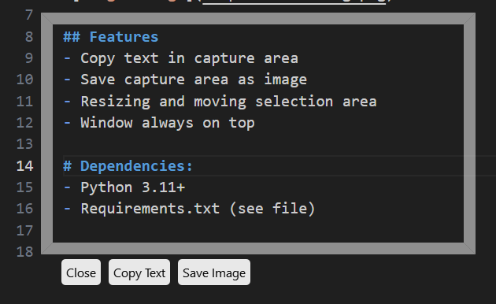

# PyCaptureText
PyCaptureText is a program that allows you to capture text from an area on the screen and save it as an image or copy the text to the clipboard.

## Features
- Copy text in capture area
- Save capture area as image
- Resizing and moving selection area
- Window always on top

## Dependencies:
- Python 3.11+
- Requirements.txt (see file)
- Windows (Tested briefly on Linux, but not fully supported)
- Tesseract
